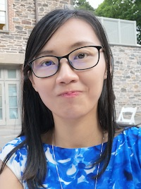
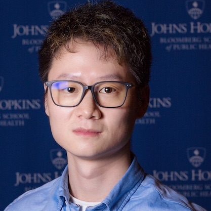



&nbsp;&nbsp;&nbsp;Kasper Daniel Hansen  
&nbsp;&nbsp;&nbsp;Professor  
&nbsp;&nbsp;&nbsp;[Department of Biostatistics](http://www.biostat.jhsph.edu)  
&nbsp;&nbsp;&nbsp;[Department of Genetic Medicine Medicine](http://www.hopkinsmedicine.org/geneticmedicine)  
&nbsp;&nbsp;&nbsp;[Department of Biomedical Engineering](https://www.bme.jhu.edu)  
&nbsp;&nbsp;&nbsp;Johns Hopkins University  
&nbsp;&nbsp;&nbsp;Twitter: [@KasperDHansen](https://twitter.com/KasperDHansen) |
GitHub: [kasperdanielhansen](https://github.com/kasperdanielhansen)  
&nbsp;&nbsp;&nbsp;[Contact](index.html) | [CV](files/hansen_cv.pdf)  

&nbsp;&nbsp;&nbsp;Adam Davidovich  
&nbsp;&nbsp;&nbsp;Postdoctoral Fellow in Biostatsistics.  
&nbsp;&nbsp;&nbsp;[Department of Biostatistics](http://www.biostat.jhsph.edu)  
&nbsp;&nbsp;&nbsp;Johns Hopkins University  
 
&nbsp;&nbsp;&nbsp;
    

&nbsp;&nbsp;&nbsp;Afrooz Razi  
&nbsp;&nbsp;&nbsp;Graduate Student in Human Genetics  
&nbsp;&nbsp;&nbsp;[Department of Genetic Medine](https://www.hopkinsmedicine.org/institute-genetic-medicine/)  
&nbsp;&nbsp;&nbsp;Johns Hopkins University  
 
&nbsp;&nbsp;&nbsp;Website: [raziafrooz](https://raziafrooz.github.io)  
    

   

### Alumni

&nbsp;&nbsp;&nbsp;Yi Wang  
&nbsp;&nbsp;&nbsp;Was: Graduate Student in Biostatistics  
&nbsp;&nbsp;&nbsp;Time in lab:  
&nbsp;&nbsp;&nbsp;First job:  
 
&nbsp;&nbsp;&nbsp;GitHub: [yiwang12](https://github.com/yiwang12)  
        

&nbsp;&nbsp;&nbsp;Leon Di Stefano  
&nbsp;&nbsp;&nbsp;Was: Graduate Student in Biostatistics  
&nbsp;&nbsp;&nbsp;Time in lab:  
&nbsp;&nbsp;&nbsp;First job:  
         

&nbsp;&nbsp;&nbsp;Leandros Boukas  
&nbsp;&nbsp;&nbsp;Was: Graduate student in Human Genetics and Postdoctoral Fellow in Biostatistics  
&nbsp;&nbsp;&nbsp;Time in lab: 2016-2020, 2020-2022.  
&nbsp;&nbsp;&nbsp;First job: resident at Children's National Hospital.  
 
&nbsp;&nbsp;&nbsp;GitHub: [leandrosboukas](https://github.com/leandrosboukas)  
&nbsp;&nbsp;&nbsp;Google Scholar: [Leandros Boukas](https://scholar.google.com/citations?user=lOJ4aQEAAAAJ&hl=en&oi=ao)
  

&nbsp;&nbsp;&nbsp;Shijie (Charles) Zheng  
&nbsp;&nbsp;&nbsp;Was: Postdoctoral Fellow in  Biostatistics  
&nbsp;&nbsp;&nbsp;Time in lab: 2019-2022.  
&nbsp;&nbsp;&nbsp;First job: computational biologist at Pfizer.  
 
&nbsp;&nbsp;&nbsp;GitHub: [sjczheng](https://github.com/sjczheng)  
&nbsp;&nbsp;&nbsp;Google Scholar: [Shijie C. Zheng](https://scholar.google.com/citations?user=tpStkPAAAAAJ&hl=en&oi=ao)  
   

&nbsp;&nbsp;&nbsp;Peter Hickey  
&nbsp;&nbsp;&nbsp;Was: Postdoctoral Fellow in Biostatistics  
&nbsp;&nbsp;&nbsp;Time in lab: 2016-2018  
&nbsp;&nbsp;&nbsp;First job: Senior Research Officer at WEHI  
&nbsp;&nbsp;&nbsp;  
 
&nbsp;&nbsp;&nbsp;Twitter: [@PeteHaitch](https://twitter.com/PeteHaitch) |
GitHub: [PeteHaitch](https://github.com/PeteHaitch)  
&nbsp;&nbsp;&nbsp;[Personal Webpage](http://www.peterhickey.org)  
  

&nbsp;&nbsp;&nbsp;Kipper Fletez-Brant  
&nbsp;&nbsp;&nbsp;Was: Graduate Student in Human Genetics  
&nbsp;&nbsp;&nbsp;Time in lab: 2013-2018  
&nbsp;&nbsp;&nbsp;First job: Computational Biologist at 23andMe  
&nbsp;&nbsp;&nbsp;  
 
&nbsp;&nbsp;&nbsp;Twitter: [@kipperfb](https://twitter.com/kipperfb) | GitHub: [cafletezbrant](https://github.com/cafletezbrant)  
  

&nbsp;&nbsp;&nbsp;Leslie Myint  
&nbsp;&nbsp;&nbsp;Was: Graduate Student in Biostatistics  
&nbsp;&nbsp;&nbsp;Time in lab: 2013-2018  
&nbsp;&nbsp;&nbsp;First job: Assistant Professor at [Macalester College](https://www.macalester.edu/mscs/facultystaff/leslie-myint/)  
&nbsp;&nbsp;&nbsp;  
 
&nbsp;&nbsp;&nbsp;Twitter: [@lesliemyint](https://twitter.com/lesliemyint) | GitHub: [lmyint](https://github.com/lmyint)  
&nbsp;&nbsp;&nbsp;[Personal Webpage](https://lmyint.github.io/)__
        

&nbsp;&nbsp;&nbsp;Jean-Philippe Fortin  
&nbsp;&nbsp;&nbsp;Was: Graduate Student in Biostatistics  
&nbsp;&nbsp;&nbsp;Time in lab: 2012-2016  
&nbsp;&nbsp;&nbsp;First Job: Postdoc at UPenn with Taki Shinohara  
&nbsp;&nbsp;&nbsp;Now: Bioinformatics Scientist at Genentech  
 
&nbsp;&nbsp;&nbsp;Twitter: [@JayPykw](https://twitter.com/JayPykw) |
GitHub: [Jfortin1](https://github.com/Jfortin1)  
     

### Previous Visitors

&nbsp;&nbsp;&nbsp;Shijie (Charles) Zheng  
&nbsp;&nbsp;&nbsp;Visiting Scholar at Biostatistics  
 
&nbsp;&nbsp;&nbsp;GitHub: [sjczheng](https://github.com/sjczheng)  
       

